<p align="center">
  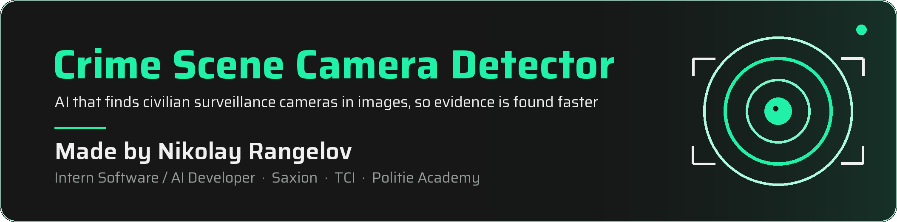
</p>

<p align="center">
  <a href="https://www.saxion.edu/"></a>
  &nbsp;&nbsp;&nbsp;&nbsp;
  
  &nbsp;&nbsp;&nbsp;&nbsp;
  <a href="https://www.politieacademie.nl/">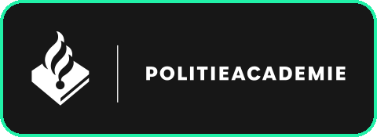</a>
  &nbsp;&nbsp;&nbsp;&nbsp;
  <a href="https://uktc.bg/"></a>
  &nbsp;&nbsp;&nbsp;&nbsp;
  <a href="https://github.com/Izu83">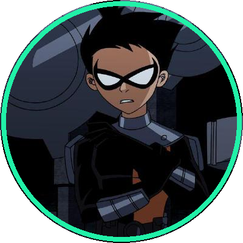</a>
  &nbsp;&nbsp;
  <a href="https://github.com/mitkor2">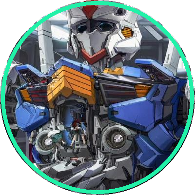</a>
</p>

<p align="center">
  <a href="https://www.python.org/"></a>
  <a href="https://docs.ultralytics.com/models/yolov8/"></a>
  <a href="https://onnx.ai/"></a>
  <a href="https://roboflow.com/"></a>
</p>

<h2 id="contents"></h2>

<p align="center">
  <a href="#about"></a>
  <a href="#poster"></a>
  <a href="#requirements"></a>
  <a href="#dataset"></a>
  <a href="#models"></a>
  <a href="#results"></a>
  <a href="#takeaways"></a>
  <a href="#layout"></a>
  <a href="#running"></a>
  <a href="#limitations"></a>
  <a href="#next"></a>
  <a href="#thanks"></a>
</p>


<h2 id="about">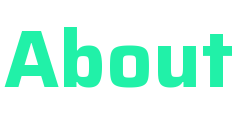</h2>

When police arrive at a crime scene, one of the first jobs is finding out whether any nearby cameras saw what happened. Doorbells, shop fronts, parking lots, someone's balcony. Right now that mostly means walking the perimeter, looking up at buildings and knocking on doors, all while the footage on those cameras slowly gets overwritten.

This project is a first step at speeding that up. It's an image classifier that looks at a photo and tells you whether there is a civilian surveillance camera in it. The idea is that hours of searching by hand can turn into minutes.

I built it during my internship as a software/AI developer. The work was done for **Saxion University of Applied Sciences**, together with **TCI (Technologies for Criminal Investigation)** and the **Politie Academy** in the Netherlands.

| | |
| --- | --- |
| **Author** | Nikolay Rangelov ([Izu83](https://github.com/Izu83)) |
| **Role** | Intern, Software / AI Developer |
| **Mentor** | Dimitar Rangelov ([mitkor2](https://github.com/mitkor2)) |
| **Made for** | Saxion University of Applied Sciences, TCI and Politie Academy (Netherlands)  |
| **School** | UKTC, National High School of Computer Technologies and Systems  |

<h2 id="poster">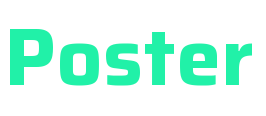</h2>

The full story on one page. Click it to open the PDF.

<p align="center">
  <a href="poster.pdf">
    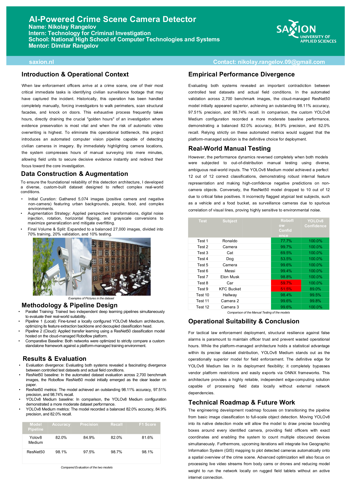
  </a>
</p>

The complete write-up is in [`technical_report.docx`](technical_report.docx).

<h2 id="requirements"></h2>

An officer on scene doesn't have time for a tool that is slow or unreliable, so the model was judged against a few practical requirements:

- **High recall.** Missing a real camera is worse than checking a false alarm.
- **Decent precision.** If it cries wolf too often, people stop trusting it.
- **Fast inference.** It has to beat searching by hand, otherwise there is no point.
- **Robustness.** Different lighting, mounting angles and camera types.
- **Works offline.** It should be able to run on a field device without a constant internet connection.

<h2 id="dataset"></h2>

The task is binary classification with two classes: `Camera` and `No Camera`.

Images came from public datasets and image repositories. For the camera class that meant camera-focused datasets. For the no-camera class I pulled from broader sources like COCO, Open Images and Roboflow Universe, so the model sees plenty of people, food, animals, vehicles, sports scenes, hallways and other everyday things.

| Stage | Camera | No Camera | Total |
| --- | ---: | ---: | ---: |
| Before augmentation | 2,422 | 2,652 | 5,074 |
| After augmentation | 13,500 | 13,500 | 27,000 |

| Split | Share | Images |
| --- | ---: | ---: |
| Training | 70% | 18,900 |
| Validation | 20% | 5,400 |
| Test | 10% | 2,700 |

To get from around 5,000 photos to a balanced 27,000, I augmented the data with:

- horizontal and vertical flips
- 90° rotations and small rotations (±15°)
- brightness (±25%), exposure (±15%) and saturation (±30%) changes
- noise (up to 2%)
- perspective transforms
- grayscale conversion

<h2 id="models"></h2>

I trained two different pipelines on the same data and compared them.

| Model | What it is |
| --- | --- |
| **YOLOv8 Medium** | Ultralytics YOLOv8m classification model, trained locally. Chosen for flexibility and because it exports to ONNX. |
| **Roboflow ResNet50** | Cloud-managed classifier on Roboflow, using transfer learning with a ResNet50 backbone. |

The point wasn't only to see which one scores higher. It was to figure out which one would actually work better for police in the field.

<h2 id="results">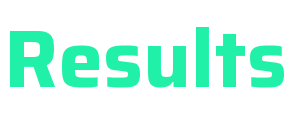</h2>

### Automated test set (2,700 images)

| Metric | Roboflow ResNet50 | YOLOv8 Medium |
| --- | ---: | ---: |
| Correct predictions | 2,649 | 2,213 |
| Accuracy | **98.11%** | 82.0% |
| Precision | **97.51%** | 84.9% |
| Recall | **98.74%** | 82.0% |
| F1 score | **98.12%** | 81.6% |

On paper, Roboflow wins clearly, with only 51 mistakes out of 2,700 images.

### Manual real-world test (12 images)

Then I tried both models on 12 photos I picked by hand: three cameras, plus things that are definitely not cameras (footballers, a cat, a dog, a car, a bucket of fried chicken, a hallway).

| Model | Score |
| --- | ---: |
| Roboflow ResNet50 | 10 / 12 |
| **YOLOv8 Medium** | **12 / 12** |

The ranking flipped. Roboflow labelled the car and the chicken bucket as cameras, though with low confidence (59.7% and 51.5%).

| Test subject | Roboflow | YOLOv8 |
| --- | ---: | ---: |
| Ronaldo | 77.7% | 100.0% |
| Camera | 99.7% | 100.0% |
| Cat | 69.5% | 100.0% |
| Dog | 53.5% | 100.0% |
| Camera | 99.6% | 100.0% |
| Messi | 99.4% | 100.0% |
| Elon Musk | 98.8% | 100.0% |
| Car | 59.7% | 100.0% |
| KFC bucket | 51.5% | 89.0% |
| Hallway | 98.4% | 99.5% |
| Camera 2 | 99.6% | 99.8% |
| Camera 3 | 99.6% | 100.0% |

<h2 id="takeaways">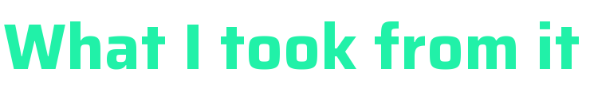</h2>

- Strong numbers on a test set don't automatically mean strong behaviour on new images. Roboflow looked better on paper, but YOLOv8 held up better on things it had never seen.
- Roboflow's two mistakes were low-confidence, so a confidence threshold would probably catch them.
- YOLOv8 leans towards flagging a possible camera. That means a few more false alarms, but fewer missed cameras, and for an investigation a missed camera is the more expensive mistake.

### Recommendation

I recommend **YOLOv8 Medium** as the main model. It did best on the real-world test, it exports to ONNX, and it runs on your own hardware without depending on a cloud platform. That makes it a much better fit for eventually running on a tablet in the field.

<h2 id="layout"></h2>

```
CameraDetector/
├── YOLOv8_Medium/
│   ├── Scripts/        train.py, evaluate.py, test.py, ONNX model
│   ├── runs/           training run: metrics, confusion matrices, plots
│   ├── images/         the 12 manual test images
│   └── onnx_export.txt how to export to ONNX
├── Roboflow/
│   ├── main.py         inference on the manual test images
│   ├── evaluate.py     evaluation on the 2,700-image test set
│   └── manual_tests/   the same 12 test images
├── assets/             images used in this README
├── poster.pdf
└── technical_report.docx
```

<h2 id="running">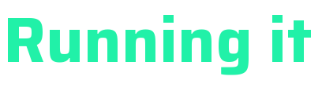</h2>

### YOLOv8 Medium

```bash
pip install ultralytics

# train (edit the paths and settings at the top of the script first)
python YOLOv8_Medium/Scripts/train.py

# try it on an image or a folder of images
python YOLOv8_Medium/Scripts/test.py --source path/to/image.jpg
```

To export the trained model to ONNX, run this in the folder that holds the `.pt` file:

```bash
yolo export model=yolov8m-cls.pt format=onnx
```

A ready-made export is already in `YOLOv8_Medium/Scripts/yolov8m-cls.onnx`.

### Roboflow

```bash
pip install inference
python Roboflow/main.py
```

This needs your own Roboflow API key.

<h2 id="limitations"></h2>

It is still a plain classifier, so for now it can't:

- draw boxes around where the camera is
- count several cameras in the same picture
- tell what type of camera it is
- work on live video
- put cameras on a map

The dataset could also use more variety: more lighting conditions, camera designs, mounting angles and environments.

<h2 id="next"></h2>

- Move from classification to real object detection, with bounding boxes around every camera
- Handle multiple cameras per image
- Plot detections on a GIS or live map
- Process video from body cams, dashcams or drones
- Shrink the model so it runs locally on rugged field tablets
- Add a feedback loop so mistakes made in the field can be used to improve the next version

<h2 id="thanks">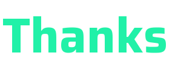</h2>

Thank you to my mentor **Dimitar Rangelov** for the guidance throughout the internship, and to **Saxion**, **TCI** and the **Politie Academy** in the Netherlands for the opportunity to work on something with a real use case behind it. Thanks also to my school, **UKTC**.

<p align="center">
  <sub> Nikolay Rangelov · Intern Software / AI Developer </sub>
</p>
